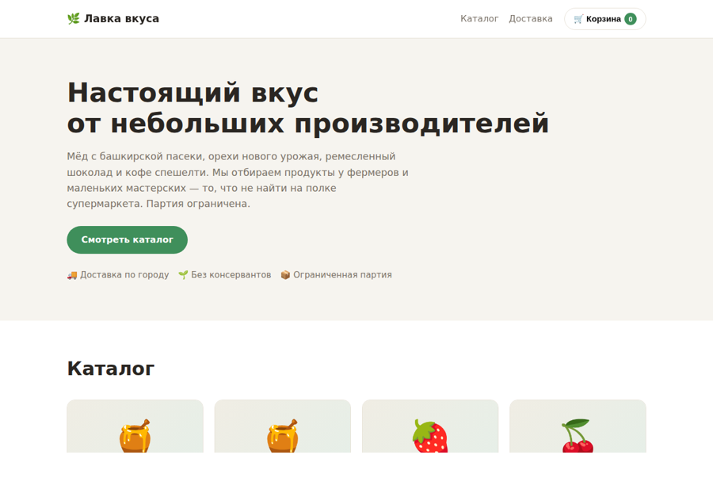
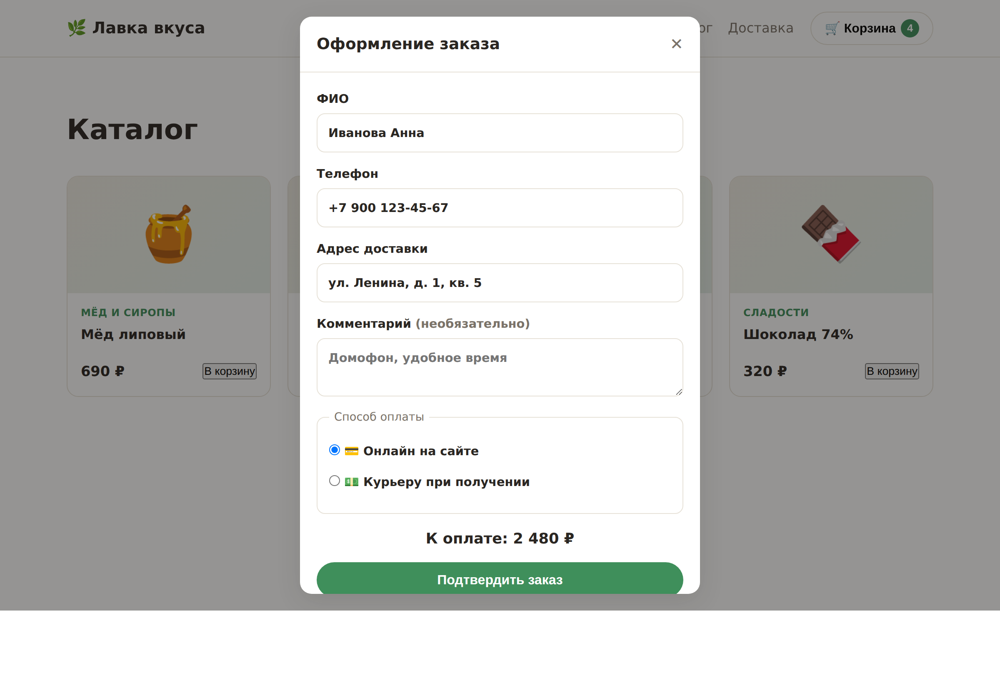
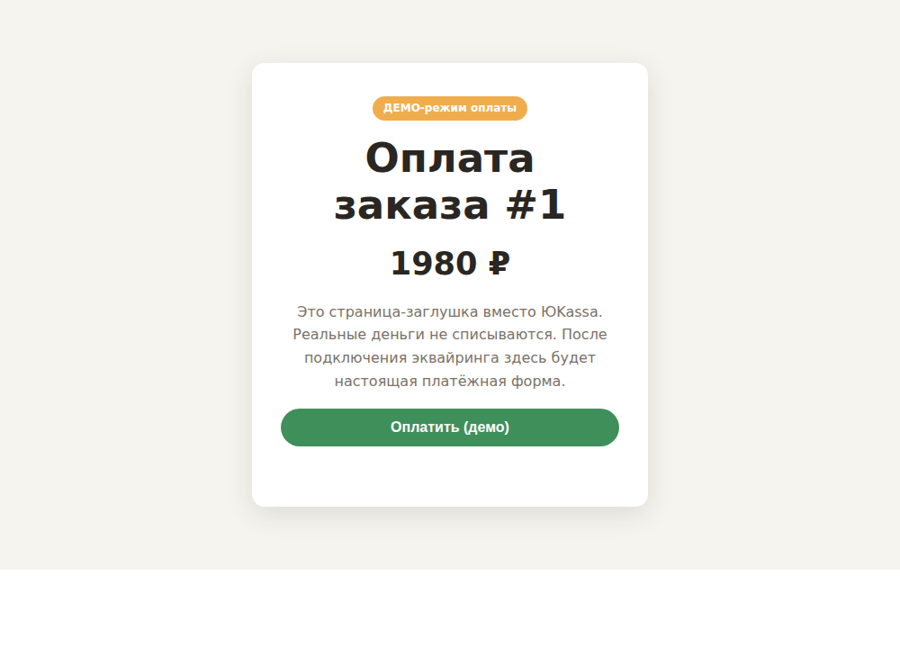

# 🛒 Лендинг интернет-магазина с корзиной и онлайн-оплатой

Одностраничный магазин под быстрый запуск продаж ограниченной партии товара:
каталог, корзина, оформление заказа, онлайн-оплата через ЮKassa и приём заказов
на email + Telegram. Без личного кабинета и лишних интеграций.

> **🚀 Живое демо: [slaker-shop.duckdns.org:8443](https://slaker-shop.duckdns.org:8443/)** —
> соберите корзину и оформите заказ (оплата в демо-режиме, деньги не списываются).

## Стек

- **Backend:** Python, FastAPI, SQLite
- **Frontend:** чистые HTML / CSS / JavaScript — без конструкторов и фреймворков
- **Оплата:** ЮKassa (создание платежа + подтверждение по вебхуку)
- **Уведомления:** email (SMTP) и Telegram
- **Деплой:** Docker / docker-compose

## Скриншоты

**Каталог и бренд:**



**Оформление заказа — ФИО, адрес, выбор способа оплаты:**



**Онлайн-оплата:**



## Возможности

- 🧺 Каталог на 20 SKU с категориями, ценами и фасовкой
- 🛒 Корзина с сохранением между визитами, изменение количества в карточке
- 📦 Минимальная сумма заказа с блокировкой оформления до её достижения
- 📝 Оформление: ФИО, телефон, адрес, способ оплаты (онлайн / курьеру)
- 💳 Онлайн-оплата ЮKassa + демо-режим, когда ключи не заданы
- 📨 Заказы на email и в Telegram
- 🚫 Переключатель «продажи приостановлены» для распроданной партии
- 🔒 Цены считаются на сервере — подделать стоимость из браузера нельзя

## Запуск

```bash
cp .env.example .env      # можно оставить как есть — заработает демо-режим оплаты
docker compose up -d --build
# магазин на http://localhost:8000
```

Без ключей ЮKassa магазин работает в демо-режиме: платёжная страница имитируется,
деньги не списываются — весь путь заказа можно показать до подключения эквайринга.
Все настройки (ключи ЮKassa, SMTP, Telegram, минимальная сумма) — в `.env.example`.

## Структура

```
app/           # FastAPI: каталог, заказ, оплата, вебхук, админ
├── main.py    config.py   store.py   payments.py   notify.py
data/products.json  # каталог (20 SKU)
static/        # index.html, style.css, app.js, success.html
```

## Под вашу задачу

Каталог, бренд и тексты — демонстрационные. Под реальный магазин меняются товары,
название и цвета; логика корзины, оплаты и приёма заказов готова.
Нужен такой магазин? Пишите: [github.com/slakertop1](https://github.com/slakertop1)

## Лицензия

MIT — см. [LICENSE](LICENSE).
